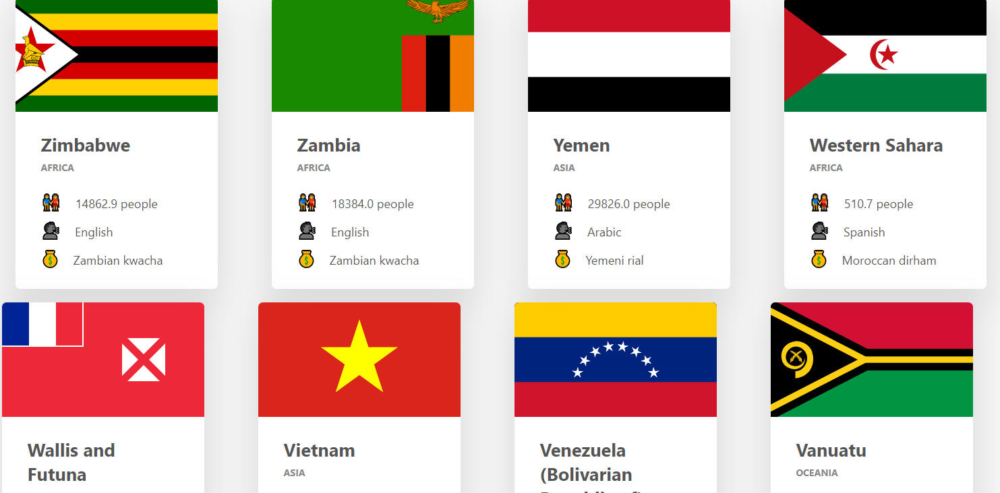
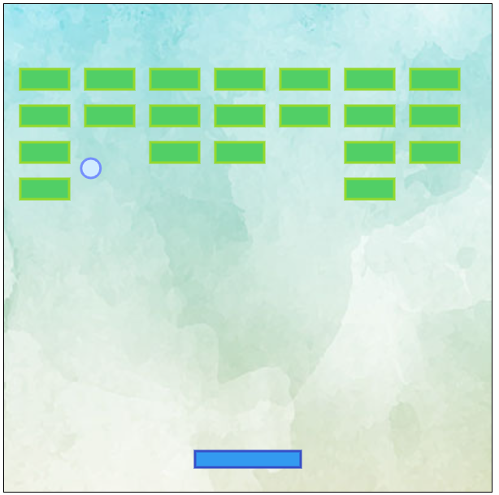
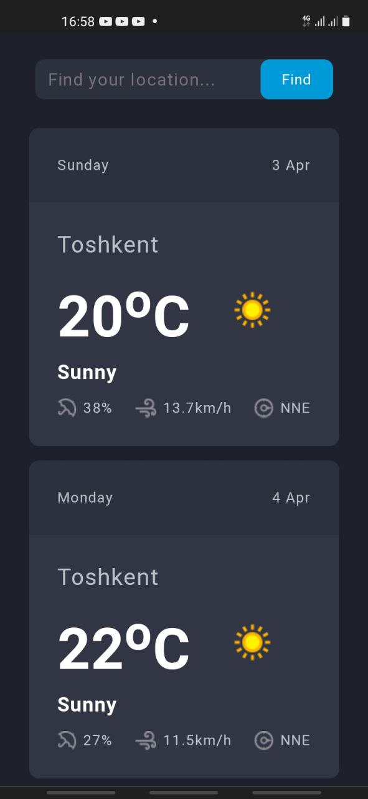
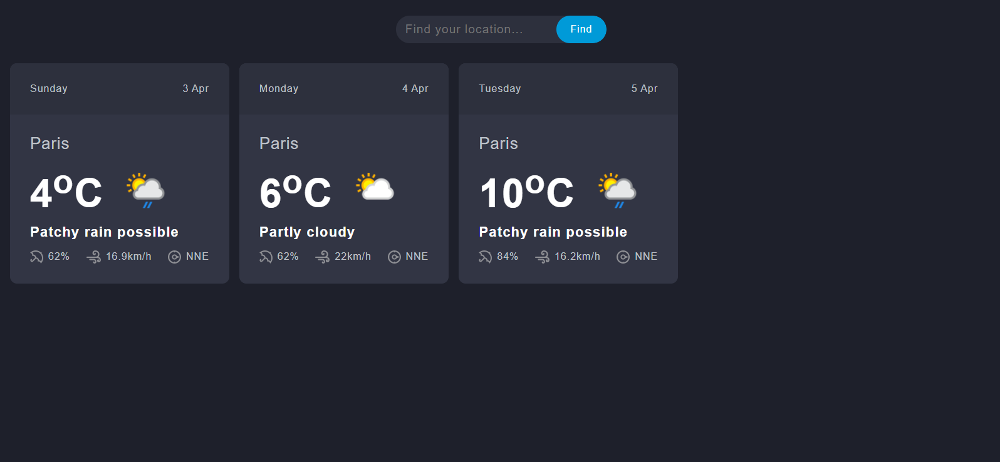
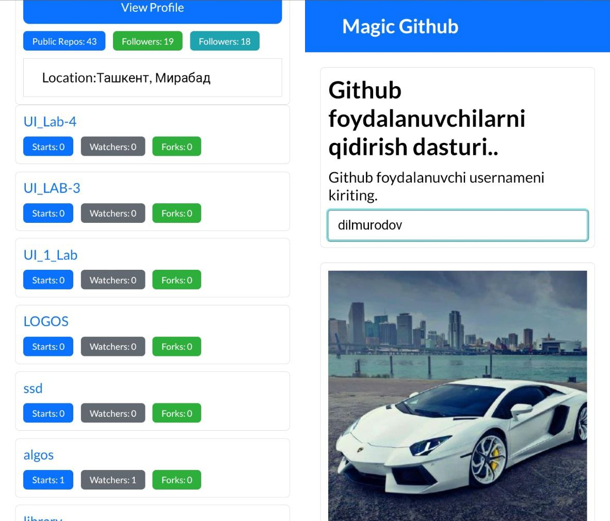

1. Project flipCards

url: https://dilmurodov.github.io/user-interface-projects-using-js/flipSectionParts/index.html

2. Project Countries Card

url: https://dilmurodov.github.io/user-interface-projects-using-js/CountriesCards/index.html

### Used:
* AJAX/JS
* HTML/CSS

3. Project Breakout Game

url: https://dilmurodov.github.io/user-interface-projects-using-js/break_game/index.html

* CANVAS/JS

4. Project Weather App

* Fetch API
* Error Hendling
* Working with Loader
* Request/Response
* Responsive 

5. Project Github Profile

* Fetch API
* Async/await
* Promise
* Responsive
